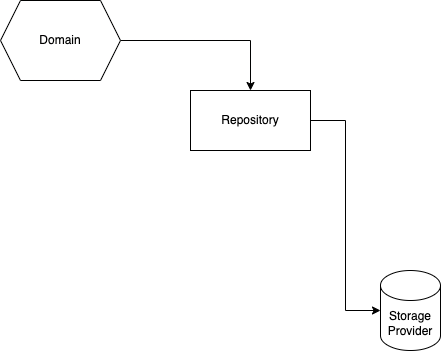

# Design Patterns — Part 1: Most Used/Useful

## Repository

This pattern is used for interaction with the database, or any other database-like storage (e.g., filesystem, session storage, 
cache, etc.).



Most repositories have all CRUD operations:

- creating
- getting a single item
- getting many items
- updating a single item
- deleting a single item

Optional features of this CRUD base:

- getting many with filters, sorting, pagination
- updating many items with a filter
- upsert-ing a single item
- deleting many items with a filter

And then there are sometimes custom methods that are more specific to your domain, especially, when complex relations are involved.

If you are implementing a Repository pattern in your application's codebase, then you know how it will be used, and it's recommended
to use the business domain concepts and types. You should try to never expose the raw types and details of the storage provider that
is being used under the hood.

If you are implementing a re-usable library, then you should also try to hide the details of the storage provider, although, you'll
find it much harder to do. Parametric types would be key here if you're working with static-typed language.

Trivia: Often, the Repository serves as an implementation of the Adapter in the Ports & Adapters architecture.

## Gateway

This pattern is used for interaction with third-party services on and outside the machine the application is running on. You would
use this pattern when the third-party provider can't be classified as a general database/storage-like service. Most often that
means that you're delegating some business domain logic to that third-party service, that is more complex than simple storage.


Moreover, if your application consists of multiple separately-running services (aka microservices architecture), then direct
interaction between services also will go through the Gateway pattern. There are a couple of reasons behind this:

- Service backing the implementation is easier to replace with a rewrite of that service.
- Can also be replaced with external provider.
- Symmetrically, an external provider can be replaced with a service built in-house if necessary.

The Gateways are always specific to your business domain, and every single one will have a unique interface depending on what needs
to be done. Hence, Gateways always live as part of your business application, and can't be made generic, like Repositories. That's
another key difference between the two.

Trivia: Often, the Gateway serves as an implementation of the Adapter in the Ports & Adapters architecture.

## Strategy

This pattern is used when there are multiple scenarios, or multiple types of things, that need to execute the same kind of operation
but the operation needs to have different implementation for each of the scenarios or types.


This pattern isn't usually applied immediately, and instead is a natural refactoring toward when you see that there is a switch on
type of switch on scenario with complex implementations that do the same thing from high level, but differently in detail.

All the parts of this pattern sit tightly in the business domain code. Nothing is left to the infrastructure code.

The domain code using the strategy and the one deciding what strategy implementation should be used are usually different parts of 
the code that don't know much about each other.

Usually the deciding code will have a switch on type or context:

```typescript
// deciding code
switch (thing.type) {
  case "A": return new ImplA();
  case "B": return new ImplB();
  case "C": return new ImplC();
  default: return new ImplDefault();
}
```

This type of switch statement sometimes leaves inside of Factory pattern as well.

And then the code using it doesn't have to know how the switch is made:

```typescript
// using code
const service = ServiceFactory.createFor(thing);
await service.doStuff();
```

Frequently, strategies have only one exposed method, however, sometimes they can have multiple.

## Proxy or Delegator

This pattern is used when extra logic needs to be added to all methods of another object. The logic added can be simple logging, 
deciding which actions should be and should not be performed, and can go as complex as adding new orthogonal behaviours to the
already existing domain code without modifying it (aka manual aspect-oriented programming).


Usually, the Proxy doesn't know how to instantiate the object that it delegates to, and it is instead dependency injected. The
methods are normally delegated transparently, and for some methods where extra logic needs to be added, that logic is added:

- before
- after
- or instead of calling the delegate

Example:

```typescript
interface Service {
  someMethod(someParam: string): Promise<string>;
}

class ServiceImpl implements Service {
  async someMethod(someParam: string): Promise<string> {
    return "stub";
  }
}

class ServiceProxy implements Service {
  constructor(private delegate: Service) {
  }
  
  async someMethod(someParam: string): Promise<string> {
    // extra logic before
    
    const result = await this.delegate.someMethod(someParam)
    
    // extra logic after, possibly modifying result
    
    return result;
  }
}
```

## Kata

1. Think where you already use the above patterns in your codebase, draw few example as diagrams per each pattern.
2. Think where you still can use the above patterns in your codebase, but aren't using. Draw few example diagrams.
